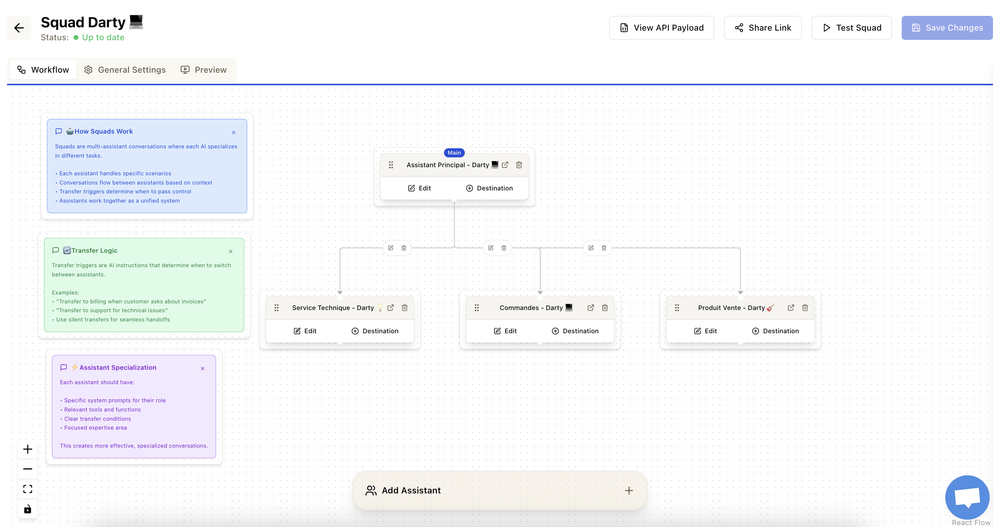

# Bravi <> Founding Engineer Test

<aside>
💡

**Time Limit:** min 4 -max 10 hours
**Focus:** LLM Tool Calling & Multi-Agent Orchestration
**What You're Building:** An Assistant Squad Builder

</aside>

## Test Overview - From a Single Assistant to a Squad

Welcome to the Bravi take-home test! 💃

This challenge is designed to mirror the problems we solve every day: building intelligent AI assistants that can use tools and work together to accomplish complex tasks.

The test is divided into two parts, building upon each other. Your goal is to build a visual system using React Flow and a real LLM (like OpenAI or Anthropic) to orchestrate AI assistants. We want to see how you think about system design, AI interaction, and user interfaces. 

Example of Agent orchestration we do at Bravi

## Setup & Resources

- **Framework:** Next.js 14+ with App Router
- **Frontend Hosting**: Vercel
- **Language:** TypeScript
- **Flow Library:** `@xyflow/react` (React Flow)
- **State Management:** Your choice (React Hooks, Zustand, etc.).
- **No Backend/Database:** This is a client-side challenge. You should not create any kind of authentication, database, or backend server. All state should be managed in the browser.

### LLM & API Keys

- **LLM:** You will need an API key for an LLM provider that supports function calling (e.g., OpenAI, Anthropic, Google Gemini).
- **API Key Handling:** To avoid exposing your secret key, please **do not commit it**. Instead, add a simple input field in your application's UI where the key can be entered and stored locally (e.g., in `localStorage`) for the duration of the session.

**Helpful Links:**

- React Flow Docs: [https://reactflow.dev/](https://reactflow.dev/)
- OpenAI Function Calling: [https://platform.openai.com/docs/guides/function-calling](https://platform.openai.com/docs/guides/function-calling)
- Anthropic Tool Use: [https://docs.anthropic.com/en/docs/tool-use](https://docs.anthropic.com/en/docs/tool-use)

## **Part 1 - Building a Tool-Equipped Assistant (The Soloist)**

### Overview

The goal of Part 1 is to build the fundamental unit of our squad: a single, intelligent assistant that can use tools. This will test your understanding of the core mechanics of LLM function calling, from defining tool schemas to orchestrating the multi-step conversation between the user, the LLM, and your application's code. Before you can make assistants work together, you must first be able to make one work perfectly on its own.

Your first task is to build a simple canvas where you can configure a single, powerful assistant.

**The Goal:**
Create a UI where you can add various tools to a "Main Assistant" and then test its ability to use those tools to answer user queries.

**Core Features:**

1. **Visual Canvas:** A React Flow canvas that starts with a single, non-deletable "Main Assistant" node.
2. **Assistant Configuration:** Click the assistant node to edit its system prompt.
3. **Tool Library:** A panel with pre-built tools that you can add to or remove from the assistant.
4. **Conversation panel:** A conversation panel where the user is able to talk to the assistant. The assistant must use its configured tools (via LLM function calling) to answer.

**Example:**
If the assistant has `addition` and `multiplication` tools, it should be able to solve `"Calculate (5 + 3) * 2"` by making two sequential tool calls.

### Requirements

### 1. Visual Assistant Builder

- **React Flow Canvas:** Start with one non-deletable `Main Assistant` node.
- **Configuration:** Click the node to open a sidebar/modal to edit its `systemPrompt`.
- **Tool Library UI:** Display a list of available pre-built tools.
- **Add/Remove Tools:** Create a mechanism (e.g., drag-and-drop, buttons) to add tools to the assistant. The assistant node should visually reflect which tools are attached.

### 2. Pre-built Tool Definitions

Your system should have these tools available, each with a clear function schema (name, description, parameters). You'll need to define these schemas yourself based on what an LLM needs for function calling.

- **Math Tools:**
    - `addition(a, b)`
    - `subtraction(a, b)`
    - `multiplication(a, b)`
    - `division(a, b)`
- **English Tools:**
    - `word_count(text)`
    - `letters_count(text)`
    - `most_used_word(text)`
    - `letter_frequency(text)`

### 3. Custom API Tool

- **Add a "Custom API" tool** to the library.
- When a user adds this tool, they should be able to configure:
    - Tool Name (e.g., `get_weather`)
    - API Endpoint URL
    - HTTP Method (GET/POST)
    - A simple way to define request parameters.

### 4. Live LLM Execution & Visualization

- **Conversation Panel:** A dedicated UI panel to display the back-and-forth conversation. This should include user messages, assistant responses, and tool call activity, feeling like a chat interface.
- **Restart Conversation:** Add a button to clear the conversation history and start a new session from scratch.
- **Multi-Step Logic:** The assistant should be able to chain multiple tool calls to solve a single query (e.g., for `(5+3)*2`).
- **Live Canvas Visualization:** During execution, the canvas must visually indicate what's happening. When a tool is being called by the assistant, that tool (represented on the assistant node) should be highlighted (e.g., with a color change, border, or animation).

## **Part 2 - Orchestrating an Assistant Squad (The Ensemble)**

### Overview

Now, let's evolve your single assistant into a team of specialists. Instead of making one assistant do everything, the Main Assistant will learn to delegate.

You will scale your single assistant into a collaborative squad. The focus shifts from single-agent tool use to multi-agent orchestration. The primary goal here is to design and build the logic that allows assistants to intelligently route and transfer conversations to the specialist best equipped for the task. This directly mimics Bravi's core product and tests your ability to design complex, stateful systems where multiple AI agents work together to solve problems.

**The Goal:**
Expand your canvas to support multiple assistants. The Main Assistant will act as a router, **transferring conversations** to specialized assistants (e.g., a "Math Assistant" or an "English Assistant") who have the right tools for the job. 

### 2. Specialized Assistants & Inter-Assistant Transfers

- **Multi-Assistant Canvas:** Add new assistant nodes to the canvas (e.g., "Math Assistant," "English Assistant") and connect them to the Main Assistant and **to each other**.
- **Specialized Assistants:** Each new assistant has its own system prompt and a specific set of tools.
- **Conversation Transfers:** An assistant should intelligently decide when to transfer the conversation. This is not just from the Main Assistant; specialists should be able to transfer to other specialists. For example, if the `English Assistant` receives a math question, it should transfer to the `Math Assistant`.
- **Templates:** Include a "Teacher Template" button that pre-loads a full squad configuration, including inter-assistant connections.

**Example:**

- **User:** "How many words are in 'hello world'?"
- **Main Assistant:** (Realizes this is an English question, based on its prompt) "Let me pass you to our English specialist."
- **→ Conversation transfers to English Assistant.**
- **English Assistant:** (Uses its `word_count` tool) "The phrase 'hello world' contains 2 words."
- **User:** and can you calculate ((2x3)+1)x4?
- **English Assistant:** Let me pass you to the Math assistant
etc etc

### Requirements

### 1. Multi-Assistant Canvas

- **Add Assistants:** Allow users to add new, specialized assistant nodes to the canvas (e.g., "Math Assistant", "English Assistant").
- **Connect Assistants:** Allow the user to draw directed edges between assistants to represent possible transfer paths.
- **Entry Point:** The `Main Assistant` should be clearly marked as the conversation entry point.

### 2. Transfer Configuration & Logic

- **Prompt-Driven Transfers:** An assistant decides to transfer based on its system prompt. You will need to engineer prompts to encourage this behavior.

### 3. Orchestration Engine

- When an assistant transfer happens, your application should:
    - Update the state to make the target assistant the new "active" assistant.
    - The new assistant then uses its own tools to solve the problem.
- **Visualize the Handoff:** The UI must provide clear, real-time feedback on the canvas.
    - The conversation panel should announce the transfer event.
    - The "active" assistant node on the canvas should be visually highlighted (e.g., with a colored border or glow).
    - When the active assistant calls one of its tools, that tool should also be highlighted.

### 4. A template system

- in the interface, we should be able to chose among 1 or 2 templates of squads if we don’t want to start from scratch.
- **Ex: when a template is selected,**  this should clear the canvas and set up a pre-configured squad:
    - `Main Assistant`
    - `Math Assistant` (with all math tools)
    - `English Assistant` (with all English tools)
    - Edges from `Main` to `Math` and `Main` to `English`.
    - Pre-written system prompts that enable routing.

## Putting It All Together: Example Scenarios

A robust squad can handle complex, multi-part queries that require several transfers and context to be passed between specialists. Here are some examples of queries your final implementation should be able to handle.

### Scenario 1: The Multi-Hop Calculation (Standard)

This query tests the basic multi-hop pipeline between your assistants.

**Test Query:**

> "Extract the number of words and the number of letters within the sentence "Bravi is the best company at YC", multiply those numbers together, and then add the appearance count of the most frequent letter to the result."
> 

**Expected Execution Flow:**
This requires a chain of transfers: `Main` → `English` → `Math` → `English` → `Math` to arrive at the final answer.

### Scenario 2: The Conditional Query (Advanced)

This query tests whether your squad can manage state and conditional logic. The final action depends on the result of a previous step.

**Test Query:**

> "Compare the number of words in the sentence 'Bravi is growing fast' to the result of 50 divided by 10. If the word count is greater, tell me the frequency of the letter 'a'. If not, just state that the condition was not met."
> 

**Expected Execution Flow:**

1. **`Main Assistant`** routes to the **`Math Assistant`** to solve the division first.
    - `division(50, 10)` → `5`
2. **`Math Assistant`** needs the word count, so it transfers to the **`English Assistant`**, passing along the result `5`.
3. **`English Assistant`** becomes active.
    - `word_count("Bravi is growing fast")` → `4`
4. The system (either through the assistant's prompt or application logic) must now compare the two results (`4` is not greater than `5`).
5. Because the condition is not met, the process stops.
6. The final response should be: **"The condition was not met."**

This scenario tests your system's ability to handle more than a simple, linear sequence of tasks.

## Part 3 - Bonus Challenge - The Coding Assistant

- **Create a `Coding Assistant`:** Add it to the squad and configure its routing from the Main Assistant.
- **`execute_code` Tool:** Create a tool that can safely execute simple code snippets. The implementation method is up to you; part of the challenge is choosing and justifying an appropriate technology (e.g., a third-party execution API, a web worker, etc.).
- **Advanced Multi-Hop Transfer:** Enable a flow where a query starts at one specialist, which then transfers to another.
    - **Example Query (Standard):** *"Calculate 12*5, then write a Python function that returns that value."*
    - **Example Query (Advanced):** *"Find the number of words in 'one two three four five'. Then, write and execute a Python script that creates a list with that many items and returns the length of the list. Finally, add 10 to that length."*
        - **Expected Flow:** This requires a full circle trip through your squad: `Main` → `English` (gets word count: 5) → `Coding` (generates and executes a script, returns length: 5) → `Math` (adds 10 to the result) → Final Answer: 15.

## What We're Evaluating

- **System Design (30%):** How you structure the data for assistants, tools, and the conversation state. How you design the `transfer_conversation` tool and manage the flow between assistants.
- **LLM Integration (20%):** Your understanding of function calling, prompt engineering for routing, and managing a multi-turn conversation with an AI.
- **React & Visualization (25%):** The quality of your React Flow implementation, the clarity of your UI, and how well you visualize the complex orchestration process.
- **Problem Solving & Code Quality (15%):** How you use AI tools like Cursor/Claude code, How you handle edge cases, the cleanliness of your code, and your ability to build a functioning application from a high-level spec.

## Submission Instructions

### What to Submit

1. **GitHub Repository** (Public or Private)
    - Clean, well-organized code.
    - **A detailed README is critical.**
    - add me: pierrehabte2017
2. **Live Demo**
    - Deploy to Vercel/Netlify.
3. **Loom Video**
- Create a quick video showcasing/explaning what you have built. I will share it to my cofounder Anas.

### README Template

Your README should include:

- Setup and run instructions.
- A **Design Decisions** section explaining your choices (state management, how you implemented transfers, your prompt engineering strategy).
- A section on **What You Would Add With More Time**.
- A link to your live demo.